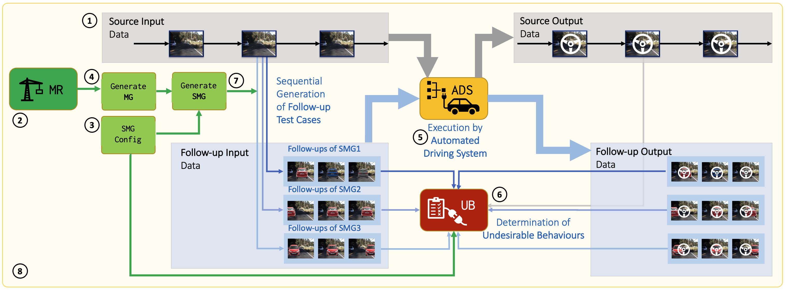
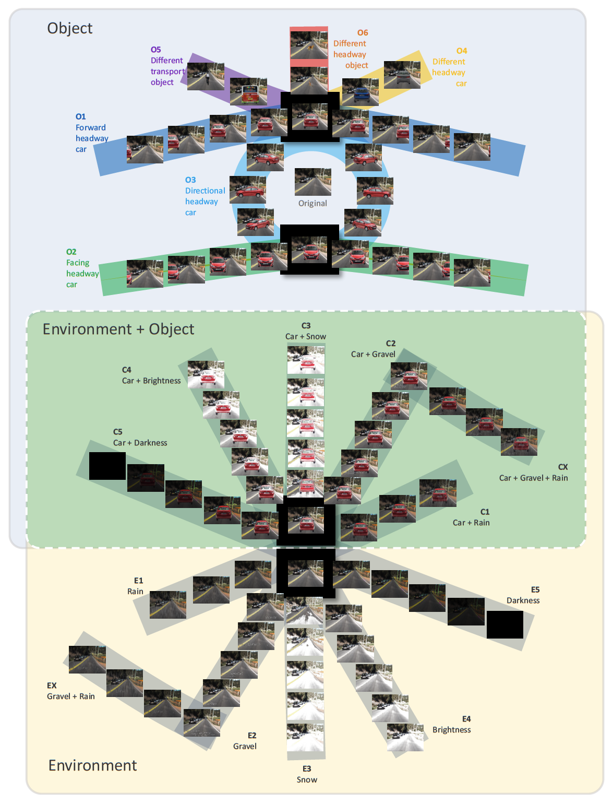

# SMART Framework
## A Sequential Metamorphic Testing (SMART) Framework for Understanding Automated Driving Systems

Note: The source code of SMART framework will be published as soon as our paper under review being accepted..

## Framework core
Pre-processing tool that is used to generate Sequences of Metamorphic Groups (SMG) from a source dataset

**Main**:
+ *core/mainframe.py*: The main program controlling the implementation of framework
+ *core/mrs.py*: The script to coordinate the MRs
+ *core/analysis/smart_core.py*: Core libarires for evaluating the undersirable behaviours
+ *core/analysis/smart_lib.py*: Supporting functions for the framework

**Generation**
+ *core/add/add.\**: The tool support the MRs for adding objects into the image at different locations, scale and shapes
+ *core/effect/effect.\**: The tool support the MRs for creating effects (rain, snow, gravel, brightness, etc.) in the images with different scale (0: none to 1: maximum).
setting

**Analysis**
+ *core/analysis/smart_stat.py*: Statistical analysis
+ *core/analysis/smart_plot.py*: Plotting functions

**Setting**
+ *smart-json-setting-rmg.txt*: The collection of SMG included in the experiments
+ *.json*: Individual settings of SMG in JSON format

## Models
Model source codes used in SMART framework, currently are steering angle based-models with Chauffeur, Autumn and Rambo. Models are configured to run on Swinburne Supercomputer, however, they can be modified to run on other supercomputers or local workstations as well.

**Chauffeur**: 
+ *models/chauffeur_successive.py*: Source code of Chauffeur model
+ *models/chauffeur_successive.sh* and *chauffeur_successive.slurm*: Bash and sbatch scripts to execute Chauffeur models
+ *models/params/chauffeur/*: weights and parameters for Chauffeur models

**Autumn**: 
+ *models/autumn_successive.py*: Source code of Autumn model
+ *models/autumn_successive.sh* and *autumn_successive.slurm*: Bash and sbatch scripts to execute Autumn models
+ *models/params/rambo/*: weights and parameters for Autumn models

**Rambo**: 
+ *models/rambo_successive.py*: Source code of Rambo model
+ *models/rambo_successive.sh* and *rambo_successive.slurm*: Bash and sbatch scripts to execute Rambo models
+ *models/params/rambo/*: weights and parameters for Rambo models

## Datasets
Datasets used in testing including the source and follow-up datasets that are basically collections of photos
+ *CH2_001*: Original Udacity dataset
+ *MTS_001*: Datasets in SMART framework with different related metamorphic groups

## Utilities
Other supporting tools
+ *arrow*: The tool for annotating arrows in the images
+ *label*: The tool for annotating labels in the images
+ *copy.sh*: Bash script to copy a set of certain scenarios from multiple folders
+ *count.sh*: Bash script to evaluate images in all folders

***

MIT License

Copyright (c) 2021 Luu Quang Hung

Permission is hereby granted, free of charge, to any person obtaining a copy of this software and associated documentation files (the "Software"), to deal in the Software without restriction, including without limitation the rights to use, copy, modify, merge, publish, distribute, sublicense, and/or sell copies of the Software, and to permit persons to whom the Software is furnished to do so, subject to the following conditions:

The above copyright notice and this permission notice shall be included in all copies or substantial portions of the Software.

THE SOFTWARE IS PROVIDED "AS IS", WITHOUT WARRANTY OF ANY KIND, EXPRESS OR IMPLIED, INCLUDING BUT NOT LIMITED TO THE WARRANTIES OF MERCHANTABILITY, FITNESS FOR A PARTICULAR PURPOSE AND NONINFRINGEMENT. IN NO EVENT SHALL THE AUTHORS OR COPYRIGHT HOLDERS BE LIABLE FOR ANY CLAIM, DAMAGES OR OTHER LIABILITY, WHETHER IN AN ACTION OF CONTRACT, TORT OR OTHERWISE, ARISING FROM, OUT OF OR IN CONNECTION WITH THE SOFTWARE OR THE USE OR OTHER DEALINGS IN THE SOFTWARE.

